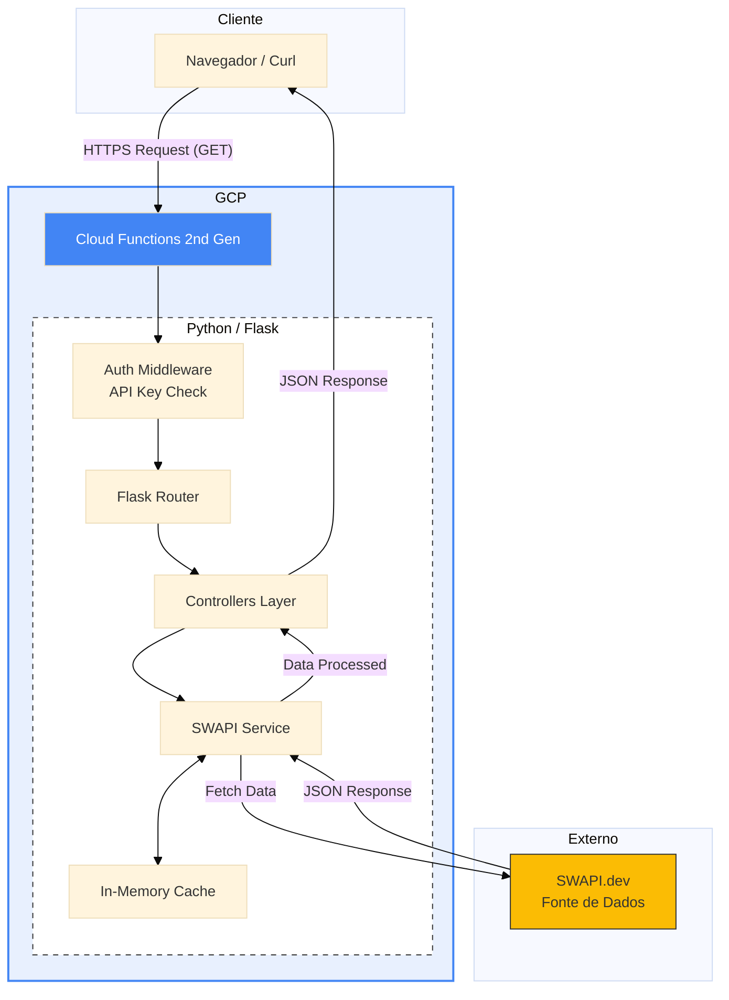

# ⭐ Star Wars API


API para consulta de informações de filmes e personagens do universo Star Wars, servindo como um wrapper otimizado da [SWAPI](https://swapi.dev/). O projeto foi desenvolvido em Python com Flask e arquitetado para deploy Serverless no **Google Cloud Functions**.

---

## 🧩 Arquitetura Técnica

O projeto segue uma arquitetura **Serverless** baseada em eventos, hospedada no Google Cloud Platform (GCP). Abaixo, o diagrama detalha o fluxo de dados e os componentes envolvidos.



## 📂 Estrutura do Projeto

```txt
starwars-api/
│
├─ app/
│  ├─ main.py                # Entry-point da aplicação (GCP / Flask)
│  ├─ auth/                 
│  │  └─ api_key.py          # Lógica de autenticação via API Key
│  ├─ controllers/           # Lógica de controle e rotas
│  │  ├─ base_controller.py
│  │  ├─ characters_controller.py
│  │  └─ films_controller.py
│  ├─ services/             
│  │  └─ swampi_service.py   # Integração e consumo da SWAPI
│  └─ utils/                 # Funções para aplicação (filtros, ordenação, etc)
│     ├─ cache.py           
│     ├─ filters.py
│     ├─ pagination.py
│     ├─ sort.py
│     └─ validators.py
│
├─ local_server.py          # Script para rodar servidor localmente
├─ openapi.yaml             # Documentação OpenAPI / Swagger
├─ requirements.txt         # Dependências do projeto
├─ README.md
├─ .gitignore
└─ tests/                   # Testes unitários e de endpoints
   ├─ endpoints/ 
   │     ├─ test_auth.py 
   │     ├─ test_characters.py 
   │     ├─ test_films.py 
   │     └─ test_errors.py 
   └─ utils/  
         ├─ test_filters.py   
         ├─ test_pagination.py   
         ├─ test_sort.py 
         └─ test_validators.py        
```

## ⚙️ Rodando Localmente
Siga os passos abaixo para executar a API em sua máquina.

### 1. Clone o repositório
```bash
git clone https://github.com/Douglas-L-A/starwars-api.git
cd starwars-api
```

### 2. Ambiente Virtual
Crie e ative o ambiente (recomendado usar Conda ou venv):
```bash
conda create -n starwars-api python=3.11
conda activate starwars-api
```
### 3. Instalação
Instale as dependências listadas no requirements.txt:
```bash
pip install -r requirements.txt
```

### 4. Configuração
Configure a variável de ambiente para simular a API Key segura:

Linux / macOS:
```bash
export API_KEY=abc123
```
Windows (CMD):
```bash
set API_KEY=abc123
```
Windows PowerShell:
```bash
$env:API_KEY="abc123"
```

### 5. Execução
Inicie o servidor local:
```bash
python local_server.py
```

A API estará disponível em: http://127.0.0.1:5000/

## 🚀 Endpoints
| Método | Endpoint | Descrição | Requer Auth |
| :---: | :--- | :--- | :---: |
| `GET` | `/` | Mensagem de status e lista de endpoints | ❌ |
| `GET` | `/films` | Lista todos os filmes da saga | ❌ |
| `GET` | `/characters` | Lista personagens (com paginação) | ❌ |
| `GET` | `/films/<id>/characters` | Lista personagens de um filme específico | ✅ |

### 📌 Parâmetros de Query (Filtros e Ordenação)

Você pode refinar as buscas utilizando os seguintes parâmetros na URL:

`order_by`: Campo para ordenação (ex: name, height, title).  
`order`: Direção da ordenação (asc ou desc).  
`limit`: Número máximo de resultados (Padrão: 50).  

#### Filtros específicos:
| Endpoint | Filtros | order_by | order |
| :--- | :---: | :---: | :---: |
| `/films` | `title` | `title` `episode_id` `release_date` | `asc` `desc` |
| `/characters` | `name` `gender` | `name` `height` `mass` | `asc` `desc` |
| `/films/<id>/characters` | `name` `gender` | `name` `height` `mass` | `asc` `desc` |

#### Exemplos de uso:
`/films?order_by=release_date&order=desc`  
`/characters?gender=male&order_by=height`  
`/films/1/characters?name=luke`

## 🔐 Autenticação
Para acessar endpoints protegidos (como `/films/<id>/characters`), é necessário enviar a chave de API no header da requisição:

Header: X-API-KEY  
Valor: abc123 (ou a chave configurada no ambiente)

## ☁️ Deploy no Google Cloud Platform
A aplicação está em produção rodando como uma Cloud Function (2nd gen).

🔗 URL Base: https://us-central1-star-wars-api-485912.cloudfunctions.net/starwars_api

## 🐍 Exemplos de Uso
### 1. Via cURL (Terminal)
Exemplo de requisição autenticada para buscar personagens do filme 1:
```bash
curl -H "X-API-KEY: abc123" \
  https://us-central1-star-wars-api-485912.cloudfunctions.net/starwars_api/films/1/characters
```

### 2. Via Python (Requests)

Script simples para consumir a API:

```python
import requests

BASE_URL = "https://us-central1-star-wars-api-485912.cloudfunctions.net/starwars_api"

# 1. Buscar Filmes (Público)
resp = requests.get(f"{BASE_URL}/films")
print("Filmes:", resp.json())

# 2. Buscar Personagens com filtro (Público)
params = {"gender": "male", "limit": 5}
resp = requests.get(f"{BASE_URL}/characters", params=params)
print("Personagens Masculinos:", resp.json())

# 3. Buscar Personagens de um Filme (Privado - Requer Header)
headers = {"X-API-KEY": "abc123"}
resp = requests.get(f"{BASE_URL}/films/1/characters", headers=headers)

if resp.status_code == 200:
    print("Elenco do Filme 1:", resp.json())
else:
    print("Erro de autenticação:", resp.status_code)
```

## 💡 Observações Técnicas
Cache: O projeto implementa um sistema de cache interno para evitar chamadas repetitivas e desnecessárias à SWAPI original, melhorando a performance.

Limitação: O limit padrão de retorno é de 50 itens, mas pode ser ajustado via query parameter.

Segurança: A API Key nunca deve ser comitada no código fonte em ambientes de produção reais; utilize Secrets Manager ou Variáveis de Ambiente.